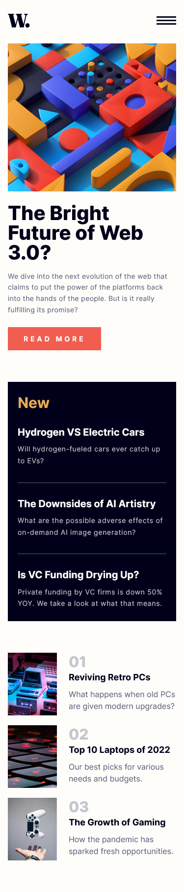

First, run the development server:

```bash
npm run dev
# or
yarn dev
```
# Frontend Mentor - News homepage solution

This is a solution to the [News homepage challenge on Frontend Mentor](https://www.frontendmentor.io/challenges/news-homepage-H6SWTa1MFl). Frontend Mentor challenges help you improve your coding skills by building realistic projects. 

## Table of contents

- [Overview](#overview)
  - [The challenge](#the-challenge)
  - [Screenshot](#screenshot)
  - [Links](#links)
- [My process](#my-process)
  - [Built with](#built-with)
  - [What I learned](#what-i-learned)
- [Author](#author)

## Overview

### The challenge

Users should be able to:

- View the optimal layout for the interface depending on their device's screen size
- See hover and focus states for all interactive elements on the page

### Screenshot




### Links

- [Solution](https://github.com/wllyvx/news-homepage)
- [Live Site](https://news-homepage-mocha.vercel.app/)

## My process

### Built with

- Semantic HTML5 markup
- CSS custom properties
- Flexbox
- CSS Grid
- Mobile-first workflow
- [React](https://reactjs.org/) - JS library
- [Next.js](https://nextjs.org/) - React framework
- [Tailwind CSS](https://tailwindcss.com/) - For styles


### What I learned

In my first Next.js project, I learned how to build server-rendered React applications using a framework that abstracted away many of the complexities of setting up a server and routing. I became familiar with concepts such as app dir, which are the building blocks of a Next.js application, and learned how to create dynamic routes based on the data I passed to them. Additionally, I learned how to utilize the built-in development server and hot reloading to make my development faster and more efficient. Overall, Next.js allowed me to create high-performance web applications with minimal configuration while still having the full power of React and webpack at my disposal.

## Author

- Willy Fajar Ramadhan
- Frontend Mentor - [@wllyvx](https://www.frontendmentor.io/profile/wllyvx)
- Github - [wllyvx](https://github.com/wllyvx)
- Twitter - [@willyframadhan](https://www.twitter.com/willyframadhan)
